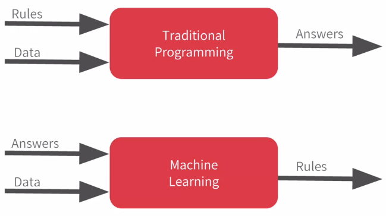

開始囉 !

# Before you begin: TensorFlow 2.0 and this course

要先安裝 Tensorflow 2.0，我從官網安裝的: https://www.tensorflow.org/install

```
# Requires the latest pip
$ pip install --upgrade pip

# Current stable release for CPU and GPU
$ pip install tensorflow
```

用 Conda 的話要下 `conda install tensorflow`

# A primer in machine learning

ML, DL 和傳統程式的不同如下



* 傳統程式: 由 **data** 和 hard-coded **rules** 來吐出 **answers**
* ML, DL: 由 **data** 和 **answers** 來學習出 **rules**

# The ‘Hello World’ of neural networks

首先針對以下的 "**data**" (X) 和 "**label**" (Y) 找出他們的關係或規律 (或正式一點: function)

``` py
X = -1,  0, 1, 2, 3, 4
y = -3, -1, 1, 3, 5, 7
```

如果你找到 f(X) = 2X-1 代表你在你腦中完成了一個 learning algorithm，我們可以用 tensorflow 中的 keras 來完成相似的任務

``` py
import numpy as np
from tensorflow.keras.layers import Dense
from tensorflow.keras import Sequential

model = Sequential([Dense(units=1, input_shape=[1])])
model.compile(optimizer='sgd', loss='mean_squared_error')

X = np.array([-1, 0, 1, 2, 3, 4], dtype=float)
y = np.array([-3, -1, 1, 3, 5, 7], dtype=float)

model.fit(X, y, epochs=500)
print(model.predict([10]))

# ...
# ...
# Epoch 499/500
# 6/6 [==============================] - 0s 167us/sample - loss: 4.7783e-05
# Epoch 500/500
# 6/6 [==============================] - 0s 167us/sample - loss: 4.6802e-05
#
# Output = [[18.980042]]
```

在這個程式中，做法和 sklearn 類似，是一個***只有單層且單個 neuron 的 NN***，但有一些新見到的架構: 

1. **Dense**: 用來描述一個 layer，可以定義有幾個 unit (neuron)
2. **Sequential**: 用來串連多個 layers

我們可以對產生的 model 進行

* 設定 (`compile`)
  * optimizer (stochastic gradient descent) 
  * loss function (mean square error)
* 訓練 (`fit`)
* 預測 (`predict`)

# Exercise

在 exercise 1 當中，我們要學習預測房價走勢，一間房為 50K 每多一個房間就多 50K，所以我們得到

| House      | Pricing |
| ---------- | ------- |
| 1 bedroom  | 100K    |
| 2 bedrooms | 150K    |
| 3 bedrooms | 200K    |
| 4 bedrooms | 250K    |
| 5 bedrooms | 300K    |
| 6 bedrooms | 350K    |

提示: 用除以 100 過後的 y 當作 labels 會更好

[Exercise 的解答在這裡](exercise1.ipynb)