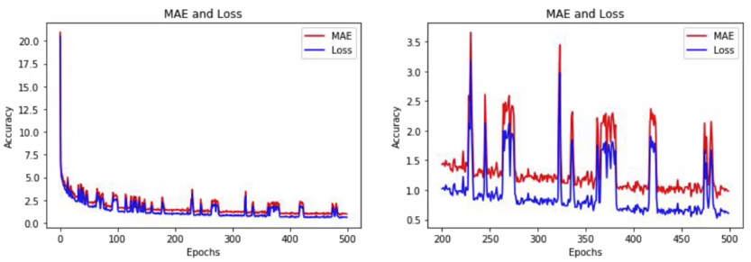
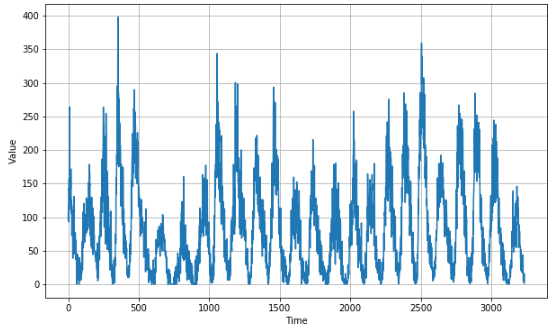
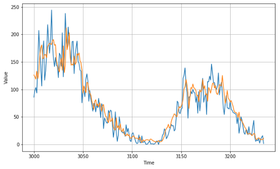

# Real-world time series data

這周要把所學的 RNN, CNN, LSTM 等技巧全部用來預測真實世界的 sunspot 資料集

## Convolutions

首先我們先針對 week 3 的模型，加入 convolutional layer 試試看

``` python
model = tf.keras.models.Sequential([
    tf.keras.layers.Conv1D(filters=32, kernel_size=5,
                        strides=1, padding="causal",
                        activation="relu",
                        input_shape=[None, 1]),
    tf.keras.layers.Bidirectional(tf.keras.layers.LSTM(32, return_sequences=True)),
    tf.keras.layers.Bidirectional(tf.keras.layers.LSTM(32, return_sequences=True)),
    tf.keras.layers.Dense(1),
    tf.keras.layers.Lambda(lambda x: x * 200)
])
```

> * Convolutional Neural Network Course 可以參考
> * https://www.coursera.org/learn/convolutional-neural-networks/home/welcome

因為加入了 `Conv1D` 所以要在前處理將資料添加一個維度

``` python
def windowed_dataset(series, window_size, batch_size, shuffle_buffer):
    series = tf.expand_dims(series, axis=-1)

    ds = tf.data.Dataset.from_tensor_slices(series)
    ds = ds.window(window_size + 1, shift=1, drop_remainder=True)
    ds = ds.flat_map(lambda w: w.batch(window_size + 1))
    ds = ds.shuffle(shuffle_buffer)
    ds = ds.map(lambda w: (w[:-1], w[1:]))
    return ds.batch(batch_size).prefetch(1)
```

結果如下，而 MAE 為 `5.297049`


我們發現 MAE 和 loss 在圖中有很多 noise 且不穩定，這可能是 batch_size 太小，造成更多 random noise 的關係



> * 有關更多 batch size 的資訊可以參考
> * https://www.youtube.com/watch?v=4qJaSmvhxi8

## Real Data - sunspots

接著來將所有學到的技巧，套用到真實的 [sunspots dataset](https://www.kaggle.com/robervalt/sunspots) 當中

資料格式:

1. index
2. sunspot 日期
3. sunspot 觀測值

```
0  1749-01-31  96.7
1  1749-02-28  104.3
2  1749-03-31  116.7
3  1749-04-30  92.8
4  1749-05-31  141.7
5  1749-06-30  139.2
...
```

將資料載入並畫出 sunspots 的 time series:

``` python
!wget --no-check-certificate \
    https://storage.googleapis.com/laurencemoroney-blog.appspot.com/Sunspots.csv \
    -O /tmp/sunspots.csv

import csv
time_step = []
sunspots = []

with open('/tmp/sunspots.csv') as csvfile:
  reader = csv.reader(csvfile, delimiter=',')
  next(reader)
  for row in reader:
    sunspots.append(float(row[2]))
    time_step.append(int(row[0]))

series = np.array(sunspots)
time = np.array(time_step)
plt.figure(figsize=(10, 6))
plot_series(time, series)
```



### Data Preprocessing

Time series 的長度共有 3500 (每一格代表一個月)，將其拆成 3000:500 train/val

``` python
split_time = 3000
time_train = time[:split_time]
x_train = series[:split_time]
time_valid = time[split_time:]
x_valid = series[split_time:]

window_size = 60
batch_size = 100
shuffle_buffer_size = 1000
```

### Training

1. 用 `windowed_dataset` 來處理資料，加入新維度、隨機分布、分出 input/label
2. 建立 Conv + LSTM 的模型並訓練

``` python
def windowed_dataset(series, window_size, batch_size, shuffle_buffer):
    series = tf.expand_dims(series, axis=-1)
    ds = tf.data.Dataset.from_tensor_slices(series)
    ds = ds.window(window_size + 1, shift=1, drop_remainder=True)
    ds = ds.flat_map(lambda w: w.batch(window_size + 1))
    ds = ds.shuffle(shuffle_buffer)
    ds = ds.map(lambda w: (w[:-1], w[1:]))
    return ds.batch(batch_size).prefetch(1)

train_set = windowed_dataset(x_train, window_size, batch_size, shuffle_buffer_size)

model = tf.keras.models.Sequential([
  tf.keras.layers.Conv1D(filters=60, kernel_size=5,
                      strides=1, padding="causal",
                      activation="relu",
                      input_shape=[None, 1]),
  tf.keras.layers.LSTM(60, return_sequences=True),
  tf.keras.layers.LSTM(60, return_sequences=True),
  tf.keras.layers.Dense(30, activation="relu"),
  tf.keras.layers.Dense(10, activation="relu"),
  tf.keras.layers.Dense(1),
  tf.keras.layers.Lambda(lambda x: x * 400)
])

optimizer = tf.keras.optimizers.SGD(lr=1e-5, momentum=0.9)
model.compile(loss=tf.keras.losses.Huber(),
              optimizer=optimizer,
              metrics=["mae"])
history = model.fit(train_set, epochs=500)

# Epoch 500/500
# 30/30 [==============================] - 4s 120ms/step - loss: 14.6739 - mae: 15.1532
```

### Predict

``` python
forecast=[]
for time in range(len(series) - window_size):
  forecast.append(model.predict(series[time:time + window_size][np.newaxis]))

forecast = forecast[split_time-window_size:]
results = np.array(forecast)[:, 0, 0]

plt.figure(figsize=(10, 6))

plot_series(time_valid, x_valid)
plot_series(time_valid, results)
```



``` python
tf.keras.metrics.mean_absolute_error(x_valid, rnn_forecast).numpy()

# 15.40074
```

# Exercise

在 exercise 4 中要使用 https://github.com/jbrownlee/Datasets 這個資料集

1. Daily minimum temperatures in the city of Melbourne, Australia
2. Measured from 1981 to 1990

操作步驟:

1. Download the dataset, parse the CSV
2. Create a time series
3. Build a prediction model from it
4. MAE should less than 2

[Exercise 4 的解答在這裡](exercise4.ipynb)